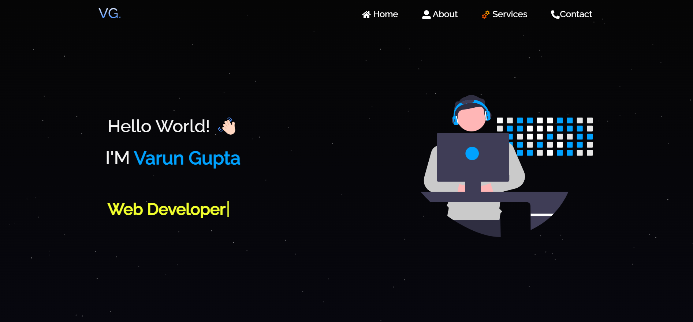

<h2 align="center">
  Portfolio Website 
  <a href="" target="_blank">VarunGupta</a>
</h2>

  

  

 

## Built With

My personal portfolio <a href="#" target="_blank">site.name</a> which features my resume and some of my technical skills. 

This project was built using these technologies.

- React.js
- Node.js
- CSS3
- VsCode
- Particle.js

## Features

**📖 Multi-Page Layout**

**🎨 Styled with React-Bootstrap and Css with easy to customize colors**

**📱 Fully Responsive**

## Getting Started

Clone down this repository. You will need `node.js` and `git` installed globally on your machine.

## 🛠 Installation and Setup Instructions

1. Installation: `npm install`

2. In the project directory, you can run: `npm start`

Runs the app in the development mode.\
Open [http://localhost:3000](http://localhost:3000) to view it in the browser.
The page will reload if you make edits.

